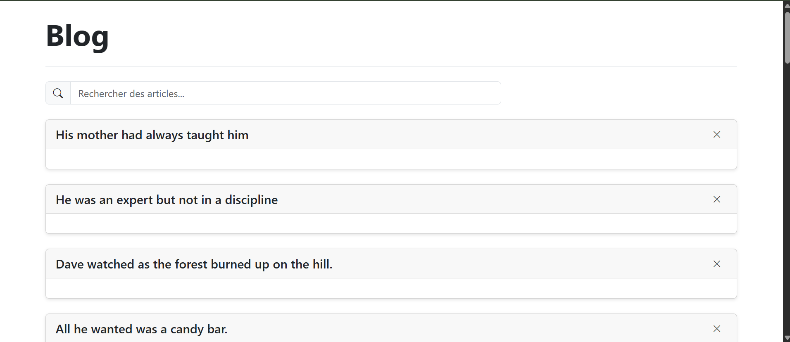
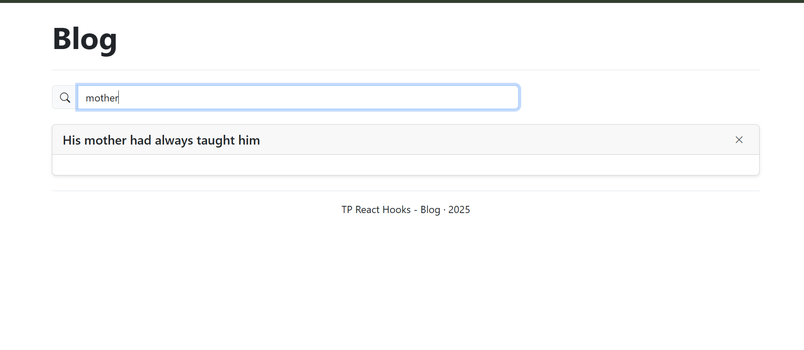

# TP React Hooks - Application de Blog

Ce TP a pour objectif de mettre en pratique l'utilisation des Hooks React (useState, useEffect, useCallback, useMemo) ainsi que la création de Hooks personnalisés à travers une application de blog simple.

## Installation et configuration initiale

1. Cloner le dépôt :

```bash
git clone https://github.com/pr-daaif/tp-react-hooks-blog.git
cd tp-react-hooks-blog
```

2. Créer votre propre dépôt sur Github et changer le remote :

```bash
# Supprimer le remote origine
git remote remove origin

# Ajouter votre nouveau remote
git remote add origin https://github.com/[votre-username]/tp-react-hooks-blog.git

# Premier push
git push -u origin main
```

3. Installer les dépendances :

```bash
npm install
```

4. Lancer l'application :

```bash
npm start
```

## Instructions pour le TP

Pour chaque exercice :

1. Lisez attentivement l'énoncé
2. Implémentez la solution
3. Testez votre implémentation (pensez à faire des copies d'écran)
4. Mettez à jour la section correspondante dans ce README avec :
   - Une brève explication de votre solution
   - Des captures d'écran montrant le fonctionnement
   - Les difficultés rencontrées et comment vous les avez résolues
5. Commitez vos changements avec un message descriptif

### Exercice 1 : État et Effets

#### Objectif : Implémenter l'affichage et la recherche de posts

- [ ] 1.1 Compléter le hook `usePosts` pour récupérer les posts depuis l'API dummyjson.com
- [ ] 1.2 Implémenter le composant `PostList` pour afficher les posts
- [ ] 1.3 Ajouter la fonctionnalité de recherche par titre ou contenu dans `PostSearch`
- [ ] 1.4 Documenter votre solution ici

_Votre réponse pour l'exercice 1 :_

Je viens de finir d'implementer les fonctionnalites de Post list et la search Bar un ajouter l'api fecth pour recupere les data et une condition dans la function baseURl pour que si l'user remplit la bare de recherche la function doit changer de url



### Exercice 2 : Hooks Personnalisés

#### Objectif : Créer des hooks réutilisables

- [ ] 2.1 Créer le hook `useDebounce` pour optimiser la recherche
- [ ] 2.2 Créer le hook `useLocalStorage` pour persister les préférences utilisateur
- [ ] 2.3 Utiliser ces hooks dans l'application
- [ ] 2.4 Documenter votre solution ici

_Votre réponse pour l'exercice 2 :_

Le hook personnalisé Usedebounce est un hook React qui simplifie le débouchement. Il résume la logique requise pour retarder les mises à jour et vous fournit une valeur débouchée que vous pouvez utiliser dans vos composants.

Le hook personnalisé Uselocalstorage est un hook qui simplifie le travail avec le storage local du navigateur. Il vous permet de stocker, de récupérer et de mettre à jour les valeurs dans LocalStorage tout en gardant votre état de réaction en synchronisation.le search sera retarder de 500 miniseconde apres chaque frape


### Exercice 3 : Optimisation et Context

#### Objectif : Gérer le thème global et optimiser les rendus

- [ ] 3.1 Créer le `ThemeContext` pour gérer le thème clair/sombre
- [ ] 3.2 Implémenter le composant `ThemeToggle`
- [ ] 3.3 Utiliser `useCallback` et `useMemo` pour optimiser les performances
- [ ] 3.4 Documenter votre solution ici

_Votre réponse pour l'exercice 3 :_

```

Expliquez votre solution ici

```

### Exercice 4 : Fonctionnalités avancées

#### Objectif : Ajouter des fonctionnalités de chargement et détail

- [ ] 4.1 Implémenter le chargement infini des posts avec `useIntersectionObserver`
- [ ] 4.2 Créer le composant `PostDetails` pour afficher les détails d'un post
- [ ] 4.3 Ajouter la fonctionnalité de filtrage par tags
- [ ] 4.4 Documenter votre solution ici

_Votre réponse pour l'exercice 4 :_

```

Expliquez votre solution ici
[Ajoutez vos captures d'écran]

```

## Structure détaillée du projet

```

📁 ./
├─ 📄 README.md
├─ 📄 package.json
├─ 📁 public/
│ └─ 📄 index.html
└─ 📁 src/
├─ 📄 App.js # Composant principal de l'application
├─ 📄 App.css # Styles CSS de l'application
├─ 📁 components/
│ ├─ 📄 PostList.js # Liste des posts
│ ├─ 📄 PostSearch.js # Barre de recherche
│ ├─ 📄 PostDetails.js # Détails d'un post
│ ├─ 📄 ThemeToggle.js # Bouton pour changer de thème
│ └─ 📄 LoadingSpinner.js # Indicateur de chargement
├─ 📁 hooks/
│ ├─ 📄 usePosts.js # Hook pour gérer les posts
│ ├─ 📄 useDebounce.js # Hook pour débouncer les valeurs
│ ├─ 📄 useLocalStorage.js # Hook pour gérer le localStorage
│ └─ 📄 useIntersectionObserver.js # Hook pour le chargement infini
├─ 📁 context/
│ └─ 📄 ThemeContext.js # Contexte pour le thème
├─ 📄 index.css
└─ 📄 index.js

```

## Ressources utiles

- Documentation de l'API: [https://dummyjson.com/docs/posts](https://dummyjson.com/docs/posts)
- Documentation React Hooks: [https://fr.reactjs.org/docs/hooks-intro.html](https://fr.reactjs.org/docs/hooks-intro.html)
- Guide sur les hooks personnalisés: [https://fr.reactjs.org/docs/hooks-custom.html](https://fr.reactjs.org/docs/hooks-custom.html)

## Rendu

- Ajoutez l'URL de votre dépôt Github dans **Classroom** et envoyez la réponse dès le démarrage de votre projet.
- Les push doivent se faire au fur et à mesure que vous avancez dans votre projet.
- Le README.md doit être à jour avec vos réponses et captures d'écran.
- Chaque exercice doit faire l'objet d'au moins un commit avec un message mentionnant le numéro de l'exercice.

---

# Documentation de l'API dummyjson - Posts

Pour réaliser ce TP, vous utiliserez l'API dummyjson.com qui fournit des données fictives de posts de blog. Voici les points d'entrée que vous utiliserez :

## Points d'entrée API

### Récupérer tous les posts

```

GET https://dummyjson.com/posts

```

Paramètres de requête optionnels :

- `limit` : nombre de posts à récupérer (défaut: 30)
- `skip` : nombre de posts à sauter (pour la pagination)

Exemple : `https://dummyjson.com/posts?limit=10&skip=10`

### Récupérer un post spécifique

```

GET https://dummyjson.com/posts/{id}

```

Exemple : `https://dummyjson.com/posts/1`

### Rechercher des posts

```

GET https://dummyjson.com/posts/search?q={terme}

```

Exemple : `https://dummyjson.com/posts/search?q=love`

### Récupérer les posts par tag

```

GET https://dummyjson.com/posts/tag/{tag}

```

Exemple : `https://dummyjson.com/posts/tag/history`

## Format de réponse

### Liste de posts

```json
{
  "posts": [
    {
      "id": 1,
      "title": "His mother had always taught him",
      "body": "His mother had always taught him not to ever think of himself as better than others. He'd tried to live by this motto. He never looked down on those who were less fortunate or whose decisions had led them astray.",
      "userId": 9,
      "tags": ["history", "american", "crime"],
      "reactions": 2
    },
    ...
  ],
  "total": 150,
  "skip": 0,
  "limit": 30
}
```

### Post unique

```json
{
  "id": 1,
  "title": "His mother had always taught him",
  "body": "His mother had always taught him not to ever think of himself as better than others. He'd tried to live by this motto. He never looked down on those who were less fortunate or whose decisions had led them astray.",
  "userId": 9,
  "tags": ["history", "american", "crime"],
  "reactions": 2
}
```

## Conseils d'utilisation

- Pour la pagination, utilisez les paramètres `limit` et `skip`
- Pour calculer le nombre total de pages, utilisez la formule : `Math.ceil(total / limit)`
- Pour implémenter le défilement infini, chargez plus de posts quand l'utilisateur atteint le bas de la page
- Pour la recherche, utilisez le point d'entrée `/posts/search` avec le paramètre `q`
- Vous pouvez combiner les paramètres de recherche avec les paramètres de pagination
